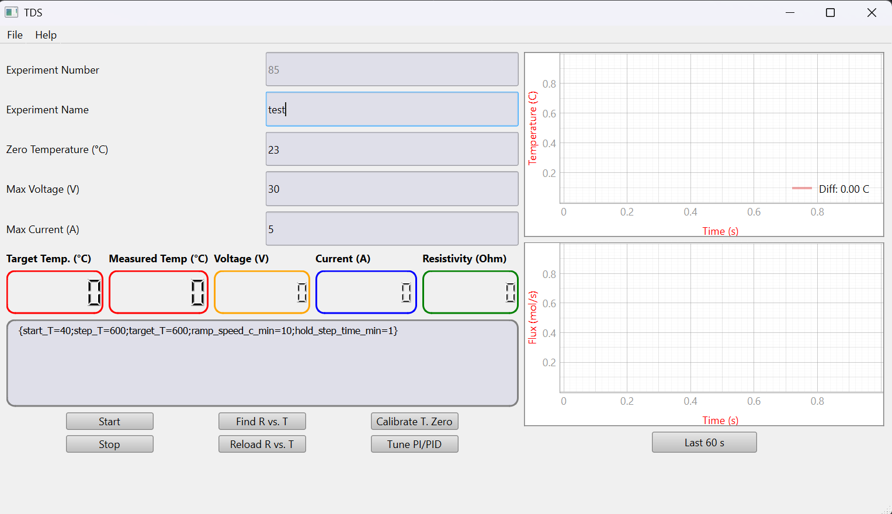
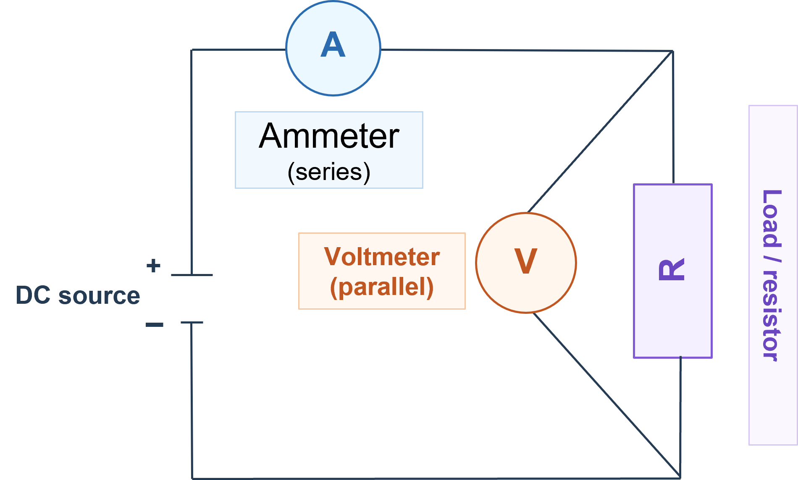

# TDS Control Software

Desktop software for running a temperature-programmed resistivity experiment with:

- one Siglent power supply,
- one DMM for voltage,
- one DMM for current,
- a loaded resistivity-vs-temperature calibration curve.

The application is written with PyQt6 and PyVISA. It controls the power supply, estimates sample temperature from resistance, follows a temperature program, and saves data continuously while the experiment is running.



## Wiring

Use the instruments as shown below:



What the diagram means:

- The ammeter must be in series with the sample, so all current from the power supply flows through the current meter first and then through the wire.
- The voltmeter must be in parallel with the sample, so it measures the voltage drop directly across the wire or resistor under test.
- The power supply positive output goes to the ammeter input, then from the ammeter to the top side of the sample.
- The bottom side of the sample returns to the power supply negative output.
- The voltmeter connects across the two sample terminals, not in series.

For this software that means:

- `DMM_i` is the Siglent DMM wired as the ammeter in series.
- `DMM_v` is the Siglent DMM wired as the voltmeter across the sample.
- `PS` is the Siglent DC power supply driving the sample.

Do not connect the current meter in parallel across the sample, because that can short the source and damage the setup.

## Features

- Load an `R vs. T` file from `.xlsx` or `.csv`
- Auto-load the selected file immediately after `Find R vs. T`
- Reload the same file later with `Reload R vs. T`
- Calibrate the room-temperature `T0` reference against the loaded curve
- Tune conservative PI/PID gains from a low-rise step test before the experiment
- Run stepped ramps or a simple continuous ramp
- Live plots for temperature and flux placeholder
- Continuous background autosave to:
  - `data.csv`
  - `data.h5`
  - `r_vs_t.csv`
- Close confirmation when exiting the GUI

## Requirements

Install Python packages from [requirements.txt](requirements.txt):

```bash
pip install -r requirements.txt
```

The project currently depends on:

- `pyqt6`
- `pyvisa`
- `pyvisa-py`
- `pandas`
- `openpyxl`
- `h5py`
- `scipy`
- `pyqtgraph`

You also need working VISA access for the connected instruments.

## Configuration

The instrument addresses and control defaults now live in [files/config.toml](files/config.toml).

This file uses TOML instead of JSON so comments can be kept directly in the file.
Each setting has a short explanation above it to make hand-editing easier for normal users.
If you still have an older `files/config.json`, the app will import it automatically the first time and write a new `config.toml`.

Important fields:

- `controller_mode`: choose `"PI"` or `"PID"`
- `DMM_v`: VISA address for the voltage DMM
- `DMM_i`: VISA address for the current DMM
- `PS`: VISA address for the power supply
- `experiment_frequency`: control loop frequency in Hz
- `max_voltage`: absolute software voltage limit
- `max_current`: absolute software current limit
- `t0_voltage_search_start`: starting voltage for the `T0` search
- `t0_calibration_voltage`: highest voltage the `T0` search is allowed to use
- `t0_settle_time_s`: how long the wire is allowed to settle before `T0` samples are accepted
- `tuning_start_voltage`: starting voltage for the PI/PID tuning search
- `tuning_search_max_voltage`: highest voltage the PI/PID tuning search is allowed to use
- `tuning_response_voltage_step`: how much each PI/PID tuning attempt increases above the safe baseline voltage

Controller mode notes:

- `controller_mode = "PI"` is the default and recommended starting point
- set `controller_mode = "PID"` if you want derivative action enabled
- the `Tune PI/PID` button uses the selected mode from `config.toml`

The software also stores tuned controller gains and autosave defaults in this file after you run the GUI.

## R vs. T File Format

Accepted input:

- Excel `.xlsx`
- CSV `.csv`

Required columns:

- `resistivity`
- `temperature [C]`

Also accepted for reloads created by this app:

- `temperature`

## Running the GUI

Start the application with:

```bash
python -m tds_control
```

or keep using the compatibility launcher:

```bash
python TDS.py
```

## Typical Workflow

1. Click `Find R vs. T` and select the calibration file.
   The file is loaded automatically.
2. Check the `Zero Temperature (°C)` value.
   This should be the actual room or base temperature.
3. Optional: click `Calibrate T. Zero`.
   This rescales the loaded resistivity curve so the measured low-voltage room-temperature resistance matches the entered `Zero Temperature`.
4. Optional: click `Tune PI/PID`.
   The software performs a guarded low-voltage step test with a small temperature rise and stores the tuned gains in `files/config.toml`.
   By default this tunes a PI controller because `controller_mode = "PI"` is the default.
5. Enter the experiment program in the text box.
6. Set software limits for `Max Voltage` and `Max Current`.
7. Click `Start`.

## Experiment Program Format

The text box accepts one line per experiment step.

Example:

```text
{start_T=23;step_T=600;target_T=600;ramp_speed_c_min=10;hold_step_time_min=1}
```

Meaning:

- `start_T`: temperature where the programmed sequence begins
- `step_T`: step size in degrees C
- `target_T`: final temperature target
- `ramp_speed_c_min`: target ramp speed in degrees C per minute
- `hold_step_time_min`: hold time at each step in minutes

Behavior:

- If `step_T >= target_T - start_T`, the program becomes a simple ramp.
- Otherwise the loop ramps to each intermediate step, holds for the requested time, and stops as soon as the final plateau is reached.

## Safety Behavior

The control loop now includes:

- voltage step-up and step-down limits
- PID anti-windup
- rate limiting when temperature rises too quickly
- current protection using `max_current`
- invalid-measurement detection
- automatic voltage shutdown at the end of the run

Even with these protections, first runs on a new sample should be done with conservative limits and supervision.

## Data Output

Each run creates a folder like:

```text
data/<experiment_counter>_<experiment_name>/
```

Saved files:

- `data.csv`: continuously appended human-readable data file
- `data.h5`: continuously appended HDF5 data file
- `r_vs_t.csv`: the exact calibration curve used for that run

Autosave runs in a background thread so disk writing does not block experiment control.

## Notes on Calibration

### `Calibrate T. Zero`

This function does not shift the temperature setpoint directly.
It measures the sample resistance near room temperature and rescales the loaded resistivity curve so the measured room-temperature point matches the entered `Zero Temperature`.

During this step the software now:

- starts at `t0_voltage_search_start` and increases only until a stable positive current is found,
- never goes above `t0_calibration_voltage` during that search,
- waits `t0_settle_time_s` before collecting data,
- discards warmup readings,
- rejects obviously wrong outliers before calculating the final scale.

### `Tune PI/PID`

PI/PID tuning uses a guarded low-rise step response:

- it starts at `tuning_start_voltage` and increases only until a stable positive current is found,
- it uses that lowest stable-current voltage as a safe baseline voltage,
- it then applies a real step above that baseline and only increases the response voltage in bounded attempts up to `tuning_search_max_voltage`,
- it measures the baseline temperature before each response attempt,
- stops once the requested small temperature rise is reached,
- estimates conservative gains for the selected controller mode.

Mode details:

- `PI` mode is the default and leaves `Kd = 0`
- `PID` mode also estimates a conservative derivative term and uses it during the real experiment

This is intended to reduce aggressive heating before the real experiment starts.

## Development

The main implementation now lives in the package directory:

```text
tds_control/
```

Key modules:

- `tds_control/app.py`: GUI and application entry point
- `tds_control/tds_experiment.py`: experiment loop and safety logic
- `tds_control/calibration.py`: `T0` calibration and PI/PID tuning
- `tds_control/data_saver.py`: background CSV/HDF5 autosave
- `tds_control/pid.py`: PID controller
- `tds_control/siglent.py`: instrument SCPI helpers

If you edit the Qt Designer file and regenerate Python code:

```bash
pyuic6 -x files/TDS.ui -o tds_control/app.py
```

If you regenerate `tds_control/app.py` from the `.ui` file, remember that manual logic changes in the Python file will be overwritten unless they are merged back in.
